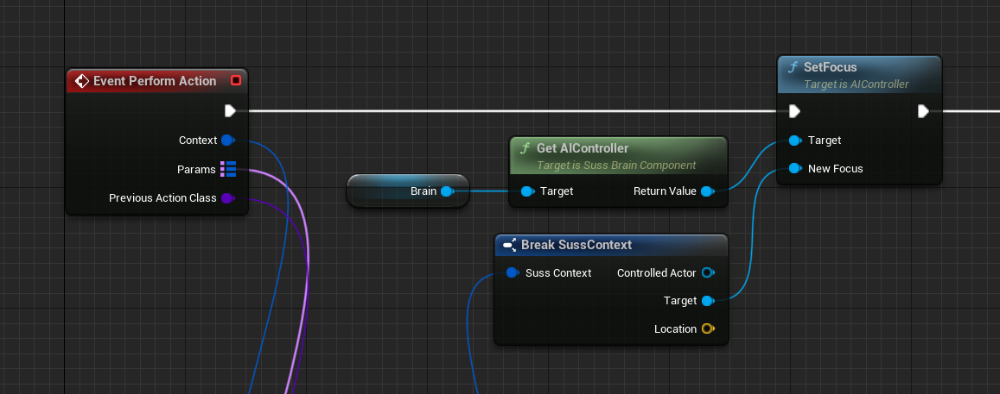
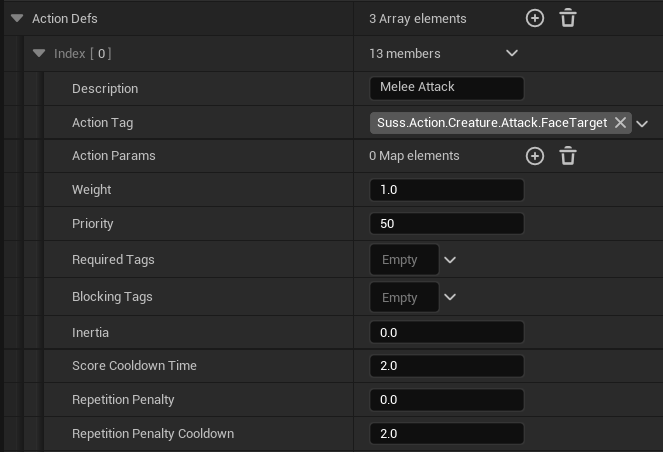
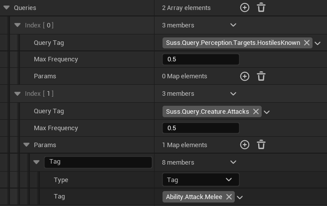
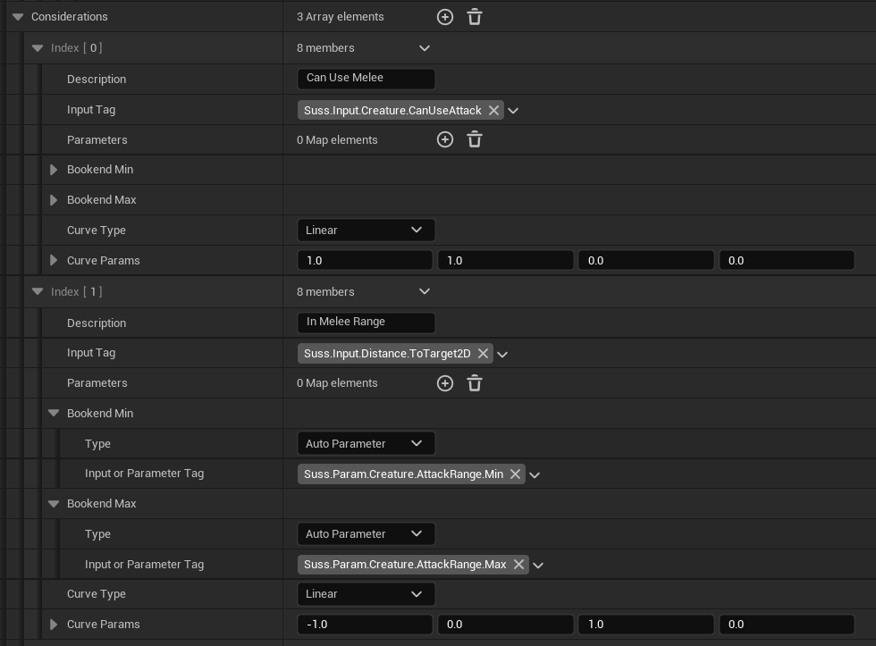

# Actions

Actions are the implementation of a decision by the agent. There are however
multiple parts to an action:

* Action Class: this is the C++ class or Blueprint that implements the action.
* Action Def: this is an entry in the brain which refers to the Action Class, plus all the
  details required to provide it context, parameters, and other instance-specific things

## Action Classes

The implementation part of the action, with all the code required to do things
like move the agent, make it activate abilities, and so on. This can be in C++
or Blueprints, and must be a subclass of `USussAction`.

To register a action new action with SUSS, see [Settings](Settings.md).

### Setup

#### Set ActionTag

Actions are identified by Gameplay Tags. Therefore one of the essential things
you must do when defining a new action is to assign a unique value to its `ActionTag`
property.

#### Implement Perform Action

Actions MUST implement a minimum of the "Perform Action" function:

Actions are instantiated when run, but instances of them are re-used, so if you 
store data in your action classes, make sure you reset it on Perform Action.

Actions are performed within a certain [Context](Contexts.md) which is why you receive 
that as input. There are also parameters, which the brain can pass along to 
modify the behaviour in this case.

Previous Action Class is only populated if this action is interrupting another.

#### Call Action Completed

In *almost* all cases you should call Action Completed when you're done. Your action
can run over many updates if it wants to, provided it's not interrupted, but when
it is finished, it should call Action Completed, which will tell the brain to 
disable it and pick another action (immediately).

#### Optional things

There are other functions you can override, including:

* Continue Action: If a brain update ran and decided to continue running this
  action, you will get this call. It's a bit like a "tick", but only sent at the 
  frequency of [brain updates](BrainUpdate.md).
* Cancel Action: If the brain changes its mind and interrupts this action, you are warned
  via this function.
* Debug Locations: If you want to show some locations on the Gameplay Debugger
* Allow Interruptions: Change this property to "false" to disallow interruptions.
  If you do this you MUST call Action Completed at some point or your action will never end.
  
## Action Defs

Action definitions are potential decisions in a brain. They use an Action to implement
them, but define the way that the action will be scored in this insteance. They
may want to add parameters, decide what contexts we should evaluate them 
against, and set considerations to use to calculate the score.

### Basic Action Def Details
Here's the basic details of an Action definition:

* Description: A user description of this action definition, which will be used in debug displays.
* Action Tag: This identifies what action class is run, should this action def win during the brain update
* Action Params: An optional set of parameters that will be passed to the action class when running it
* Weight: A final weight to apply to this action's score. Can be used to add bias
* Priority: Which [Priority Group](#priority-group) this action belongs to (see below)
* Required Tags: If supplied, this action will not run unless the agent has ALL the tags in this list
* Blocking Tags: If supplied, this action will not run if the agent has ANY the tags in this list
* Inertia: Adds an additional weight to this action in future updates if it is run (see [Inertia and Score Cooldown](Inertia.md))
* Score Cooldown Time: How long it takes for a score for this action to reduce down to 0 unless it's decided on again
* Repetition Penalty: What value to *subtract* from the score in future updates once this action has been performed.
   This is useful for making your agents not repeat themselves too much
* Repetition Penalty Cooldown: How long the Repetition Penalty takes to be reduced to 0 after performing the action

### Queries

The next thing we *might* need is queries to generate potential [Contexts](Contexts.md) for our
action to run in. If you don't add any queries, then there is only one context,
with its only value being a reference to the Controlling Actor (agent).

Queries might look like this:

Like Actions, Queries are identified by tags. SUSS provides some queries, like the
first one in this list, but you can add your own by creating a subclass of one
of the query base classes related to the type of information you're supplying,
e.g. `USussTargetQueryProvider` or `USussLocationQueryProvider`.

Each query can only provide a single element of data, such as "Target" or "Location".
When you combined more than one like this, then by default the results of each 
query are combined with every result from the other query, in all combinations.
So the result of these 2 queries will be:

1. A list of hostile targets known by the perception system
2. A list of melee attacks this enemy can do (this is a custom query in our game)

If 1. returned 2 targets, and 2. returned 3 attacks, then there would be 6
contexts generated, in every combination, and each would be evaluated for this
action. One of them will be picked based on those scores, and the action choice method.

But how are they scored? Read on...

### Considerations

Considerations score an action in a given context based on inputs and curves.
The results from each consideration are multiplied together, then by the weight
of the action definition, then finally any inertia or penalties are applied.

Considerations might look like this:

* Description: A user description of the consideration, for debugging
* Input Tag: Inputs are identified by tags like everything else. An input provider class
  must take a context and return a single floating point value.
* Parameters: If the input provider needs parameters, here's where you specify them
* Bookends: This is used to normalise the value returned from the input. They can 
  be specified manually, or bound to auto parameters (provided by Parameter Providers).
* Curve Details: Used to define the curve which transforms the normalised input value
  to a score value.

## Priority Group

Priority groups let you control how actions interrupt each other more easily,
without having to tune all scores to be perfectly correct relative to one another.

A smaller Priority Group number means that action is higher priority. These will be
evaluated first, and if any action in a higher priority group scores > 0, then no
actions in a lower group will be considered.

This can be useful when you want to divide your actions into broad groups, e.g. 
those to do when the enemy is idling, and those it might do when it is alerted
to a player. You can also set action choice methods per priority group if you 
like, e.g. using a weighted random in one group and highest score in another.

## Action Sets

Action Sets are a kind of asset that lets you define multiple Action Defs together
so they can be easily re-used in [Brain Configs](BrainConfig.md). They behave exactly 
as if you'd put all the actions in them directly into the brain config.

Like Brain Config Assets, Action Sets are a kind of asset, you create them
using right-click > Miscellaneous > Data Asset and picking "Suss Action Set".
You define Action Defs inside just like you would directly in a Brain Config.

# See Also

* [Home](../README.md)
* [Main classes](doc/MainClasses.md)
* [Brain Config](BrainConfig.md)
* [Brain Update Tick](BrainUpdate.md)