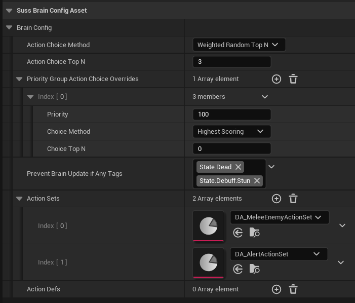

# Brain Config

The configuration of an AI agent is down to mostly data, which is contained in their
"Brain Config", which is a struct (`FSussBrainConfig`).

You're going to want to make your NPC blueprints include a Brain Config somehow,
either explicitly by adding a `FSussBrainConfig` property to them, or a
`USussBrainConfigAsset` property, which lets you reference a re-usable asset containing it.


## Initialising the brain with a Brain Config
Either way you do this, on BeginPlay you'll want to get the brain component and
assign this config, something like this:

```c++ Header file
    // -- Header file CreatureBase.h -- 
    // This version lets us use an in-place brain config or an asset

    /// In-place AI brain configuration 
	UPROPERTY(EditDefaultsOnly, Category="AI")
	FSussBrainConfig BrainConfig;

	/// Brain configuration provided from a potentially shared linked asset (overrides BrainConfig)
	UPROPERTY(EditDefaultsOnly, Category="AI")
	USussBrainConfigAsset* BrainConfigAsset;

    USussBrainComponent* GetBrainComp() const;
    void BeginPlay();
```

```c++
// -- Source file CreatureBase.cpp -- 
USussBrainComponent* ACreatureBase::GetBrainComp() const
{
	if (auto AIC = Cast<ASussAIControllerBase>(GetController()))
	{
		return AIC->GetSussBrainComponent();
	}
	return nullptr;
}

void ACreatureBase::BeginPlay()
{
	if (auto Brain = GetBrainComp())
	{
		if (IsValid(BrainConfigAsset))
		{
			Brain->SetBrainConfigFromAsset(BrainConfigAsset);
		}
		else
		{
			Brain->SetBrainConfig(BrainConfig);
		}
	}
}
```

## Creating a Brain Config Asset

1. Right-click in a content dir, select "Data Asset"
2. Pick "Suss Brain Config Asset"
3. Name it appropriately

You can edit this brain config as a separate asset which can be used by multiple NPC
blueprints.

## Brain Config Details

There's a lot to cover here since the brain config basically does everything.
But first, let's start with the root details. Here's a brain defined in an asset.



### Action Choice Methods

The first thing we decide is how to pick a "Winning" action when a brain updates.
There are a few options:

* Highest Scoring: Always pick the highest scoring action
* Weighted Random All: Pick a weighted random action from all non-zero scoring actions
* Weighted Random Top N: Pick a weighted random action from the top N non-zero scoring actions
* Weighted Random Top N Percent: Pick a weighted random action from all actions scoring within N percent of the top scorer (only non-zero)
	
You can set your choice at the top of the brain config, and that will apply for
everything by default. However, you can also set a different choice option for
individual [Priority Groups](Actions.md#priority-group) if you choose, 
in "Priority Group Action Choice Overrides".

### Action Sets and Action Defs

Action Defs are a specific instance of an [Action](Actions.md) in this brain. They represent
a choice that a brain could make. You can refer to the same action multiple times
in a single brain - you might want to do this with different action parameters for
example, that's why in the brain they're called "Action Defs" and not "Actions" (although
sometimes in these docs we'll use Action for simplicity when we mean Action Def).

You can either add Action Defs directly to a specific brain, or you can define
groups of them in [Action Sets](Actions.md#actionsets), which is what we've done in the above example.
In both cases the Action Defs are the same, it's just where they come from; at
runtime all of them are combined into one big list for evaluation.

# See Also

* [Home](../README.md)
* [Main classes](doc/MainClasses.md)
* [Brain Update Tick](BrainUpdate.md)
* [Actions](Actions.md)